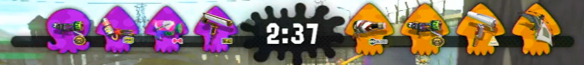
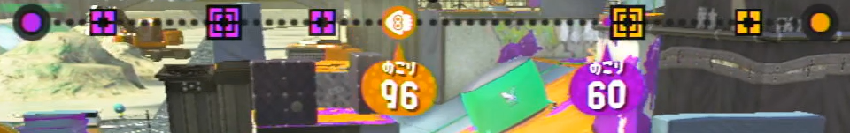
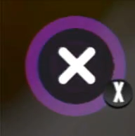

# Splatoon recorder with python

# 実装計画

- 取得・記録したい情報
  - [ ] 敵味方の生存とSP状況
  - [ ] 残り時間とカウント
  - [ ] 敵味方のSP使用状況
- 作成したい情報
  - 味方，敵の時間ごとの生死
  - 死因
  - 

- 具体的なアルゴリズム
  - 現在はマップ画面 or プレイヤー画面かで処理を分岐
    - マップ画面の判別を行う
    - 試合開始の合図の音を拾う
  - ブキを照合して味方のリストを作る

# Development log

## 画像の座標切り抜き

### 関数

- 画像サイズによらずある程度のスケール変位を許容したマッチング・評価手法。
- 異なるスケールの画像をマッチングする関数？

### 素材

- 残り時間，味方と敵の生存状況 `crop_wcenter(img1, 0.25, 0.02 ,0.1)`

- ヤグラカウント: `cimg = crop_wcenter(img1, 0.25, 0.12 ,0.14)`

- マップを開いている時左上に出るやつ：`cimg = crop_whrate(img1, 0, 0.1 ,0, 0.18)`

## 数字読み取り

白い箇所を抜いてくる。その位置でなんとなくわかるやろ。

## ブキ画像分類

### ブキ画像テンプレート作成

ブキ画像だが，人が切り抜いているのか丕きさやカラーなど若干見た目が異なる。

- 画像サイズを合わせる
- 色を合わせる

くらいは必要かなと思う。